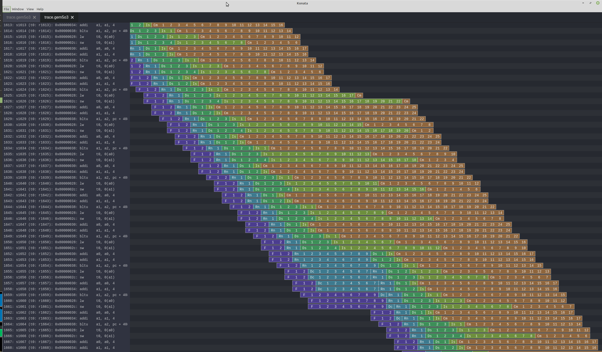

<!--
SPDX-FileCopyrightText: 2023 Everybody

SPDX-License-Identifier: CC0-1.0
-->

# How to setup things

```shell
# Get the repo
git clone https://github.com/SpinalHDL/NaxRiscv.git --recursive
cd NaxRiscv
export NAXRISCV=${PWD}
(cd ext/NaxSoftware && ./init.sh)

# Building riscv-isa-sim (spike), used as a golden model during the sim to check the dut behaviour (lock-step)
sudo apt-get install device-tree-compiler libboost-all-dev
cd $NAXRISCV/ext/riscv-isa-sim
mkdir build
cd build
../configure --prefix=$RISCV --without-boost --without-boost-asio --without-boost-regex
make -j$(nproc)

# Install ELFIO, used to load elf file in the sim 
git clone https://github.com/serge1/ELFIO.git
cd ELFIO
git checkout d251da09a07dff40af0b63b8f6c8ae71d2d1938d # Avoid C++17
sudo cp -R elfio /usr/include

# Install Verilator
sudo apt-get install git make autoconf g++ flex bison
git clone https://github.com/verilator/verilator   # Only first time
unsetenv VERILATOR_ROOT  # For csh; ignore error if on bash
unset VERILATOR_ROOT  # For bash
cd verilator
git pull        # Make sure we're up-to-date
git checkout v4.228
autoconf        # Create ./configure script
./configure
make
sudo make install

# Generate NaxRiscv
cd $NAXRISCV
sbt "runMain naxriscv.Gen"

# Install SDL2, allowing the simulation to display a framebuffer
sudo apt-get install libsdl2-2.0-0 libsdl2-dev

# Compile the simulator
cd $NAXRISCV/src/test/cpp/naxriscv
make compile
```

# How to use the simulator 

```shell
Simulation setup
--load-bin=FILE,ADDRESS : Load a binary file in the simulation memory at the given hexadecimal address. ex file,80000000
--load-hex=FILE         : Load a hex file in the simulation memory
--load-elf=FILE         : Load a elf file in the simulation memory
--start-symbol=SYMBOL   : Force the CPU to boot at the given elf symbol
--pass-symbol=SYMBOL    : The simulation will pass when the given elf symbol execute
--fail-symbol=SYMBOL    : The simulation will fail when the given elf symbol execute
--timeout=INT           : Simulation time before failure (~number of cycles x 2)
--seed=INT              : Seed used to initialize randomizers
--memory-latency=CYCLES : Specify the average memory latency from cmd to the last rsp beat
--no-stdin              : Do not redirect the terminal stdin to the simulated getc
--no-putc-flush         : The sim will not flush the terminal stdout after each sim putc
--name=STRING           : Test name reported when on exit (not very useful XD)

Simulation tracing / probing
--output-dir=DIR        : Path to where every traces will be written
--progress=PERIOD       : Will print the simulation speed each period seconds
--trace                 : Enable FST wave capture
--trace-start-time=INT  : Add a time to which the FST should start capturing
--trace-stop-time=INT   : Add a time to which the FST should stop capturng
--trace-sporadic=RATIO  : Specify that periodically the FST capture a bit of the wave
--trace-ref             : Store the spike execution traces in a file
--stats-print           : Print some stats about the CPU execution at the end of the sim
--stats-print-all       : Print all the stats possible (including which branches had miss)
--stats-start-symbol=SY : Specify at which elf symbol the stats should start capturing
--stats-stop-symbol=SYM : Specify at which elf symbol the stats should stop capturing
--stats-toggle-symbol=S : Specify at which elf symbol the stats should change its capture state
--trace-gem5            : Enable capture of the pipeline timings as a gem5 trace, readable with github konata
--spike-debug           : Enable spike debug mode (more verbose traces)
--sim-master            : The simulation will wait a sim-slave to connect and then run until pass/fail
--sim-slave             : The simulation will connect to a sim-master and then run behind it
                          When the sim-master fail, then the sim-slave will run to that point with trace enabled
--sim-slave-delay=TIME  : For the sim-slave, specify how much behind the sim-master it has to be.

Directed test argument : Used, for instance, to automate the shell interactions in the linux regression
--putc=STRING          : Send the given string to the sim getc
--getc=STRING          : Wait the sim to putc the given string
--success              : Quit the simulation successfully
```

Here is a konata visualisation of the trace produced by --trace-gem5 when running a simple memory copy loop hitting a cache miss on a dual issue pipeline: 



# Run the a application (ex Dhrystone)

```shell
cd $NAXRISCV/src/test/cpp/naxriscv
./obj_dir/VNaxRiscv --load-elf ../../../../ext/NaxSoftware/baremetal/dhrystone/build/rv32ima/dhrystone.elf --pass-symbol=pass
```

# Run a riscv-test

```shell
cd $NAXRISCV/src/test/cpp/naxriscv
./obj_dir/VNaxRiscv \
--load-elf ../../../../ext/NaxSoftware/riscv-tests/rv32ui-p-addi \
--start-symbol test_2 \
--pass-symbol pass \
--fail-symbol fail \
--timeout 10000 
```

# Run all tests

```shell
cd $NAXRISCV/src/test/cpp/naxriscv
./testsGen.py
make clean compile
make test-clean && make test-all -j$(nproc); make test-report
```

This will take about 30mn, as it also run freertos and linux.

# Run linux
```sh
cd $NAXRISCV/src/test/cpp/naxriscv
export LINUX_IMAGES=$NAXRISCV/ext/NaxSoftware/buildroot/images/rv32ima
./obj_dir/VNaxRiscv \
    --load-bin $LINUX_IMAGES/fw_jump.bin,0x80000000 \
    --load-bin $LINUX_IMAGES/linux.dtb,0x80F80000 \
    --load-bin $LINUX_IMAGES/Image,0x80400000 \
    --load-bin $LINUX_IMAGES/rootfs.cpio,0x81000000 
```

You can also use the regression test to run linux in a automated way : 

```sh
cd $NAXRISCV/src/test/cpp/naxriscv
./testsGen.py
make clean compile
make output/nax/buildroot/run0/PASS
```

# Omagad / Panic

A compilation about how to handle adversity

## it crashed in linux

In one terminal do : 

```sh
make output/nax/buildroot/run0/PASS ARGS="--sim-master"
```

In another terminal do :

```sh
make output/nax/buildroot/run0/PASS ARGS="--sim-slave --trace --trace-ref"
```

This will run the two simulation together, with the slave one a bit delayed, but when the master one crash, the slave one will start recording the traces.

You can specify that delayed with --sim-slave-delay on the slave sim. Default being 500000 (250000 cycles).

## NO PROGRESS the cpu hasn't commited anything since too long

Take a look to all the .*haltRequest.* signals in the wave
